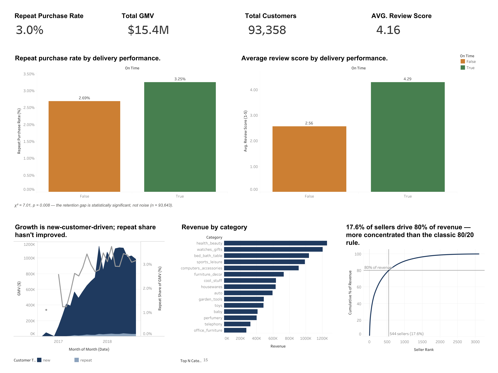

# Marketplace Retention & Performance Analysis

**SQL + Python + Tableau | Olist Brazilian E-Commerce Marketplace, 2016–2018**

### 🔗 [View the interactive dashboard on Tableau Public](https://public.tableau.com/app/profile/luong.lai/viz/E-CommerceMarketplaceRetentionPerformanceAnalysis/Dashboard1?publish=yes)



## The business questions

A marketplace's growth is only as durable as its retention. This analysis asks
three questions a marketplace operations/BD team would actually need answered:

1. **Is growth coming from new customers or repeat ones — and is that sustainable?**
2. **Does delivery performance affect whether customers come back?**
3. **Where is revenue concentrated, and where's the platform exposed?**

**North Star Metric:** Repeat Purchase Rate — the share of customers who placed
more than one order. Chosen over GMV, AOV, or CLV because it's the most direct,
least composite signal of whether a marketplace is actually retaining demand
rather than just buying it.

## Key findings

### Growth is acquisition-driven, not retention-driven

Only 3.0% of customers (2,801 of 93,358) have ever placed a second order — and
this isn't a one-off number, it holds across the platform's history. Repeat
revenue averaged just 0.97% of monthly GMV in the platform's first six months,
rising to only 3.15% in its most recent six — after two full years, the
business is still running almost entirely on new-customer acquisition rather
than a compounding repeat-customer base. *(See the dual-axis trend in "Growth
is new-customer-driven; repeat share hasn't improved.")*

### On-time delivery lifts repeat purchase rate by 21% — and it's real, not noise

Customers whose first order arrived on time repeat-purchase at 3.25%, versus
2.69% for customers whose first order was late — a 21% relative lift in the
platform's core retention metric from a single operational factor. A
chi-square test on the full population (n = 93,643) returns p = 0.008: less
than a 1% chance this gap is random variation. The satisfaction signal is even
starker — average review score drops from 4.29 (on-time) to 2.56 (late), a
1.7-point swing on a 5-point scale. *(See "Repeat purchase rate by delivery
performance" and "Average review score by delivery performance.")*

### Revenue is concentrated on both the product and seller side

`health_beauty` is the single largest category by revenue (~$1.26M), ahead of
`watches_gifts` and `bed_bath_table` — a signal of where demand is already
strongest. On the supply side, concentration is sharper than the textbook
80/20 rule: just 544 of 3,095 sellers (17.6%) generate 80% of total platform
revenue, meaning the platform depends on a smaller core of top sellers than a
typical marketplace — a real concentration risk alongside the growth-fragility
finding above. *(See "Revenue by category" and the Pareto curve.)*

## Recommendations

- **Retention, not acquisition, is the platform's central strategic risk.**
  CAC-driven growth without a retention flywheel is expensive and doesn't
  compound — and two years of data shows no sign of that flywheel starting.
- **Delivery reliability is a lever on retention, not just satisfaction.**
  Given repeat revenue is the scarce resource, fixing on-time rate for
  late-prone routes/sellers is a direct, evidenced path to moving the North
  Star — likely a stronger lever than promotional spend aimed at repeat
  purchase directly.
- **Seller concentration is a platform risk worth monitoring alongside
  growth.** Losing a handful of top sellers would materially hurt GMV.

## Methodology

- **SQL (DuckDB)** for the relational layer — joining orders, customers, order
  items, reviews, products, and sellers directly against the CSVs, no server
  required. Chosen deliberately over a single-table aggregation to demonstrate
  genuine multi-table join logic, not just `GROUP BY`.
- **Python (pandas, scipy)** for the statistical work: the chi-square test on
  the delivery/retention relationship, with an automatic fallback to Fisher's
  exact test if any expected cell count falls below 5 (checked, not assumed).
- **Tableau** for the dashboard — BANs, a dual-axis trend, a Top-N parameter,
  and a Pareto curve built from `INDEX()` with explicit sort-order control.

## Limitations

- **The delivery→retention finding is an association, not a proven causal
  effect.** A late delivery and low repeat-buying could share a common cause
  (e.g., the product category itself) rather than delivery directly causing
  churn. The evidence justifies investigating delivery as a lever — it doesn't
  by itself prove that fixing delivery will change the outcome.
- **The review-score population was corrected mid-project** from "first-order
  reviews only" to "all reviews on delivered orders" — a real methodology fix
  worth being able to explain, not just a formatting change.
- **A 3.0% repeat purchase rate is consistent with Olist's known
  characteristics** as a 2016–2018 Brazilian e-commerce platform — not a data
  quality issue, but stated plainly rather than implying a "healthy" baseline
  that doesn't exist for this platform.

## Reproducing this

```
pip install -r requirements.txt
python analysis.py
```

Outputs 5 CSVs to `data/`, ready for the Tableau workbook. Raw data: [Olist
Brazilian E-Commerce Public Dataset](https://www.kaggle.com/datasets/olistbr/brazilian-ecommerce)
(Kaggle).
